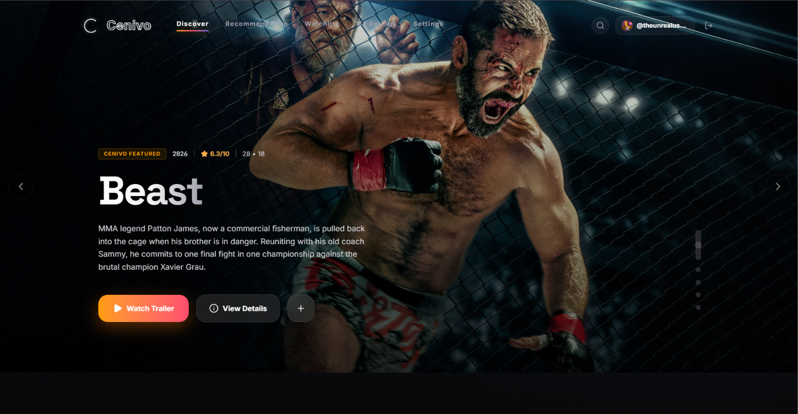
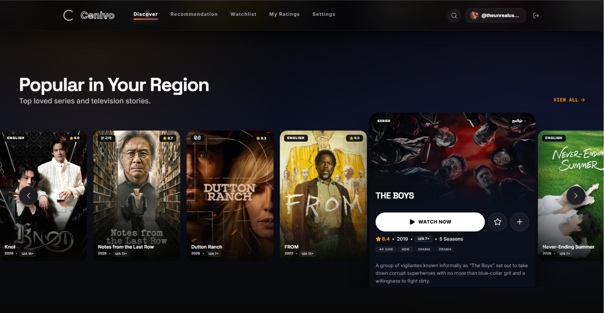
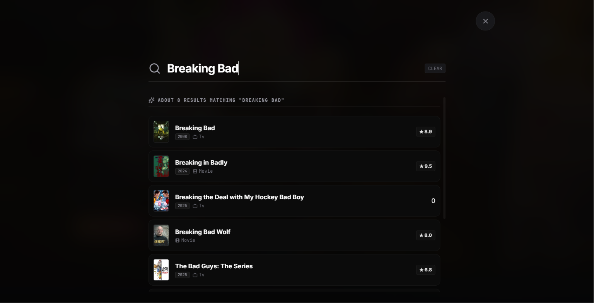
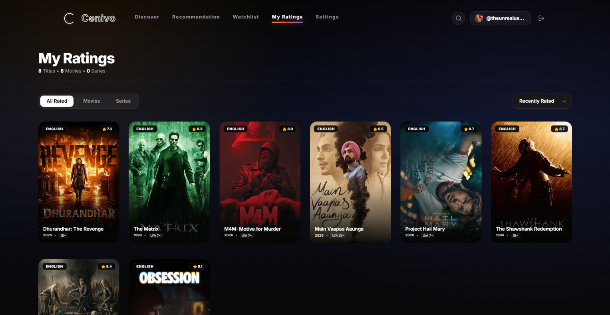
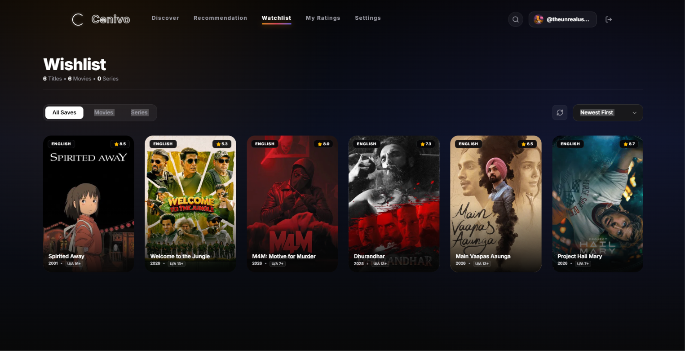
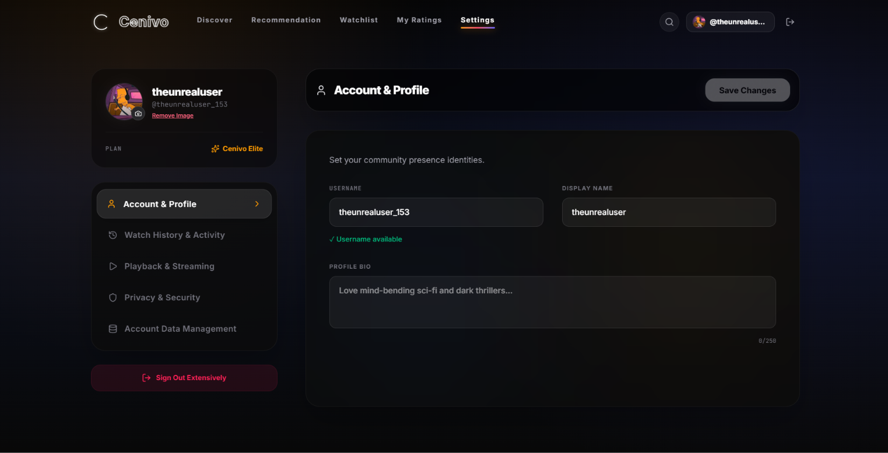

# 🎬 Cenivo

> A modern AI-powered movie & TV discovery platform built with React, Firebase, and modern web technologies.


![Made%20With-React-61DAFB)
![Firebase-Backend-FFCA28)

---

## 📖 About

Cenivo is a modern movie and TV series discovery platform inspired by premium streaming services such as Netflix, Disney+, Prime Video, and JioHotstar.

The platform is designed to help users discover trending movies and TV shows, explore detailed information, manage personal watchlists, rate content, and enjoy a clean, responsive user experience.

The project was built to improve my skills in frontend development, Firebase integration, authentication, database design, and modern UI/UX.

---

# ✨ Features

- 🎬 Browse trending movies and TV series
- 🔍 Powerful search functionality
- ❤️ Personal watchlist
- ⭐ User ratings
- 👤 Firebase Authentication
- 🎨 Modern streaming platform UI
- 📱 Responsive design
- ⚡ Fast loading experience
- 🔥 Firestore Database
- 🎥 Movie & TV details
- 🌙 Dark theme interface

---

# 🖥️ Preview

> Replace these with screenshots later.

| Home | Hero |
|------|------|
| Home Screenshot | Hero Screenshot |

---

# 🛠️ Tech Stack

## Frontend

- React
- JavaScript
- HTML5
- CSS3

## Backend

- Firebase
- Firestore Database
- Firebase Authentication

## APIs

- TMDB API

## Tools

- Git
- GitHub
- VS Code

---

# 📂 Project Structure

```
src/
├── components/
├── lib/
├── stores/
├── App.tsx/
├── data.ts/
├── indesx.css/
├── main.tsx/
└── types.ts

public/
firebase/
README.md
```

---

# 🚀 Getting Started

Clone the repository

```bash
git clone https://github.com/aryankumar-04/Cenivo.git
```

Go into the project

```bash
cd Cenivo
```

Install dependencies

```bash
npm install
```

Start development server

```bash
npm run dev
```

---

# 📸 Screenshots

### 🏠 Home Page



---

### 🎬 Discover



---

### 🔍 Search



---

### ⭐ Ratings



---

### ❤️ Watchlist



---

### ⚙️ Settings



---

# 🎯 Future Improvements

- AI-powered recommendations
- Personalized recommendation engine
- Better search filtering
- Movie trailers
- Social sharing
- Multi-language support
- PWA support
- Performance optimization

---

# 👨‍💻 Developer

**Aryan Kumar Gupta**

Aspiring Software Engineer

GitHub:
https://github.com/aryankumar-04

LinkedIn:
www.linkedin.com/in/aryankumargupta04

---

# ⭐ Support

If you like this project, consider giving it a ⭐ on GitHub.

It helps support my work and future open-source projects.

---

## 📄 License

This project is licensed under the MIT License.
